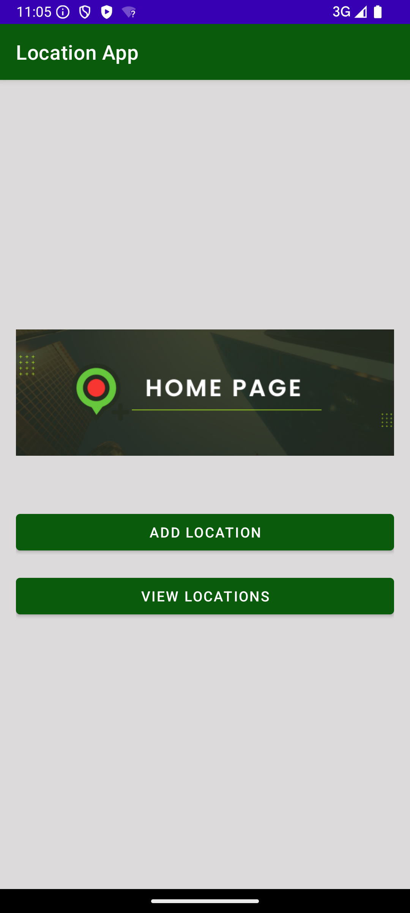
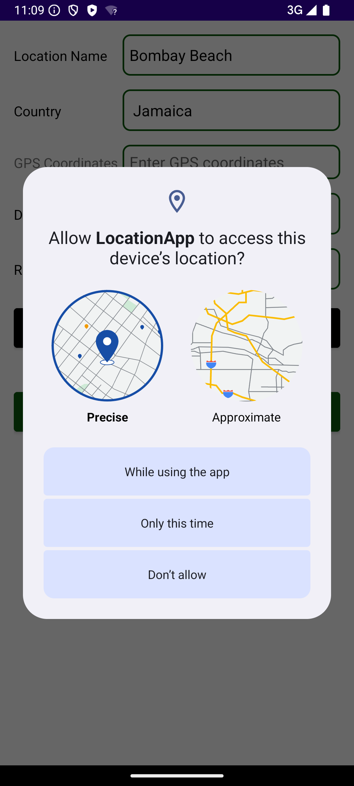
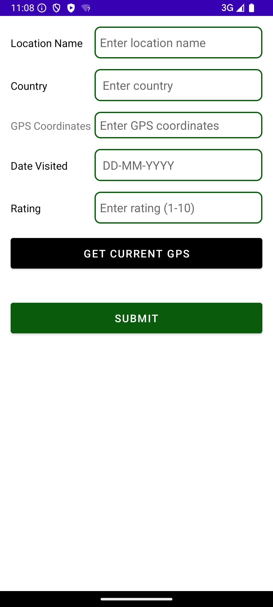
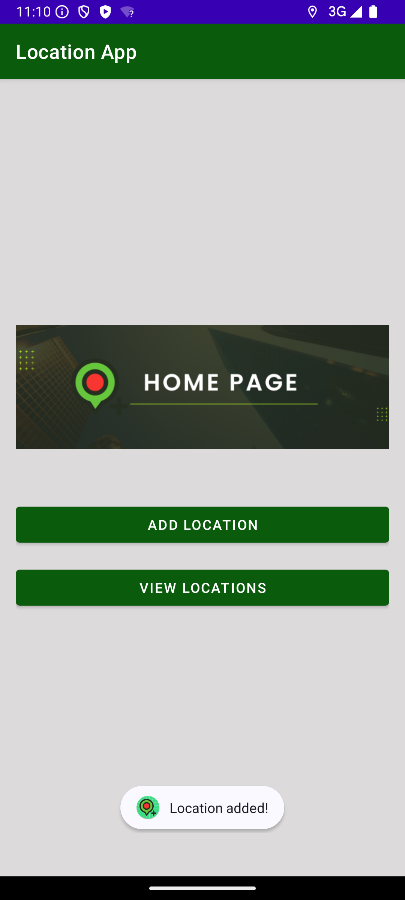
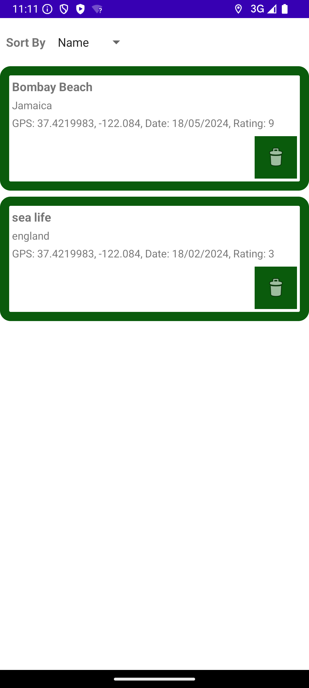

## 📱 Global Location Tracker App

An Android application that uses real-time GPS data to display the user’s current location with latitude and longitude. Built using Java and the Android SDK, the app integrates Google Play Services to deliver accurate location tracking and interactive UI feedback. Ideal for showcasing skills in mobile development, API integration, and geolocation features.

### 🌟 Features
- Real-time location tracking using FusedLocationProvider
- Display of latitude and longitude coordinates
- Mobile-first design with responsive layout
- Runtime permission handling for GPS access
- Custom UI components and error handling
- Built with Android Studio and tested on real devices

### 🧠 What It Demonstrates
- Mobile application architecture (activities, intents, services)
- Android UI/UX principles (layouts, input handling)
- Integration of system-level APIs (GPS, permissions)
- Debugging tools (Logcat, emulator, real device testing)

## Technologies Used
- Java
- Android SDK
- Google Play Services
- REST APIs
- XML for layout design

## 📸 Screenshots:

Here’s what the home page looks like:

### 🏠 Home Page

### 📍 gps request

### ➕ add locations

### notfication

### view locations

## Setup
1. Clone the repository
2. Open the project in Android Studio
3. Add your Google Maps API Key to `google_maps_api.xml`
4. Run the app on an emulator or device

## Status
Complete – built for academic purposes.

## Disclaimer
This was part of a university assignment and is provided for learning purposes only.
